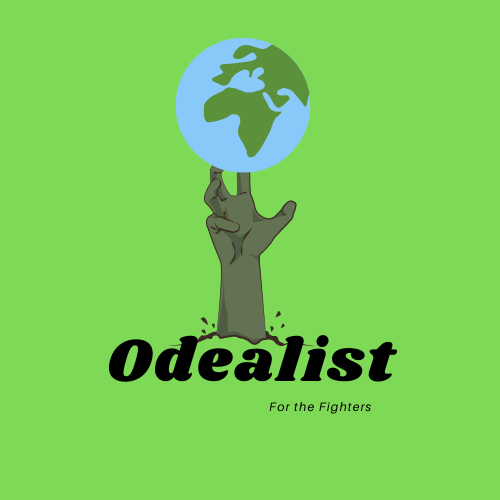

<h1>Odealist<h2>
  

Earliest version, didn't fit new style of website.

  

<h2>The Site's Mission</h2>

So often people around me that seem battered down and lethargic when the state of our planet comes up. This is understandable but there is a lot to be optimistic about. Never before have so many people been engaged in the discussion and ideas about creating a better world. And that, to me, is the right way to look at this problem.

That is how Odealist was conceptualized. A General hub for all positive or inspiring news about individuals, special interest groups or countries that are willing to wage the good fight.

The target audience for this website is:<ul>
<li>Between the age of: 15-35</li>
<li>Mid-highly educated (altough not exclusively)</li>
<li>Interested in politics/industry/philosophy</li>
</ul>

<h3>Welcoming the User</h3>

When the user enters the site the intention is to greet him/her by a main page that doesn't overwhelm with buttons and/or information, yet doesn't feel empty. With just a few pieces of information coming at the user, yet having a high definition, peaceful image to still catch a persons attention. 

<h2>User Experience</h2>

What we mean to provide for the user is a place to easily find the things they're looking for. To find any positive news stories about this subject is quite harsh. Dozens of news sites to search through in order to find what you're looking for. The important news tends not to be sensational. 
This is what we provide. With featured stories being updated every week the user will always have a reaon to come back. It's important to us to make navigation on this website as easy as can be. 
We do this by: <ul>
<li>Having our logo as home and always visible and in the same place</li>
<li>Having a crystal clear navigation bar with a smooth green colour to catch the eye</li>
<li>Having a dropdown on mobiles devices that takes the space it needs</li>
</ul> 

Photo by Rolands Varsbergs on Unsplash
Photo by Wesley Tingey on Unsplash
