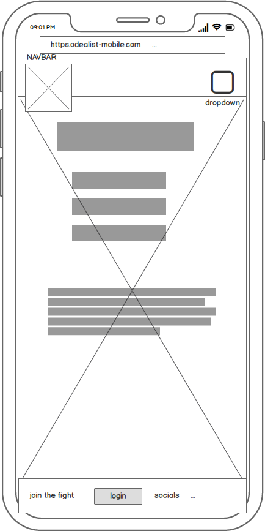
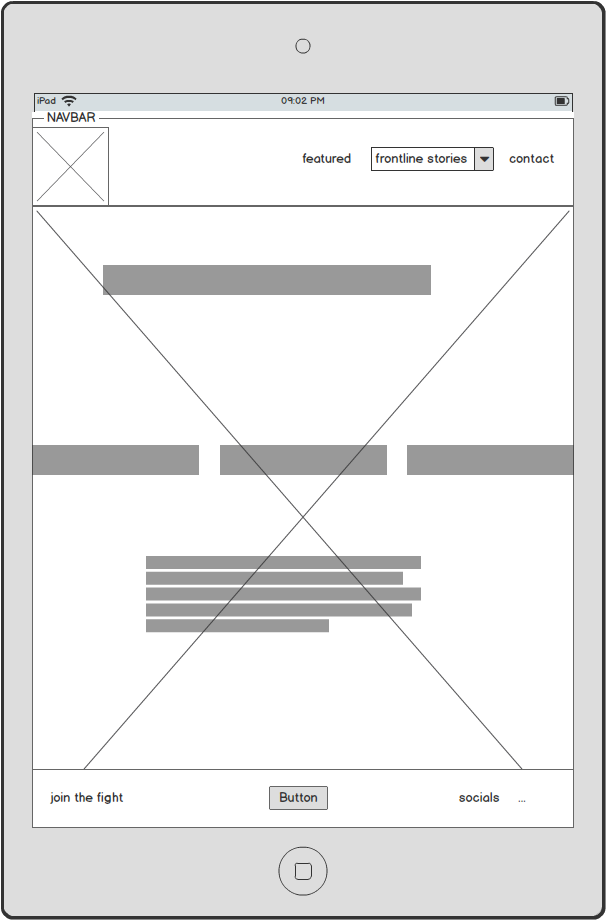
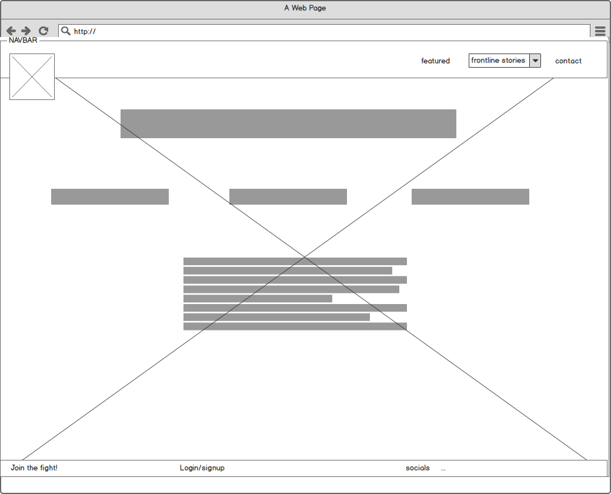

<h1>Odealist<h2>
  

Earliest version, didn't fit new style of website.

  
<section>
<h2>The Site's Mission</h2>

So often people around me that seem battered down and lethargic when the state of our planet comes up. This is understandable but there is a lot to be optimistic about. Never before have so many people been engaged in the discussion and ideas about creating a better world. And that, to me, is the right way to look at this problem.

That is how Odealist was conceptualized. A General hub for all positive or inspiring news about individuals, special interest groups or countries that are willing to wage the good fight.

The target audience for this website is:<ul>
<li>Between the age of: 15-35</li>
<li>Mid-highly educated (altough not exclusively)</li>
<li>Interested in politics/industry/philosophy</li>
</ul>

<h3>Welcoming the User</h3>

When the user enters the site the intention is to greet him/her by a main page that doesn't overwhelm with buttons and/or information, yet doesn't feel empty. With just a few pieces of information coming at the user, yet having a high definition, peaceful image to still catch the user's attention. 

<h2>User Experience</h2>

What we mean to provide for the user is a place to easily find the things they're looking for. To find any positive news stories about this subject is quite harsh. Dozens of news sites to search through in order to find what you're looking for. The important news tends not to be sensational. 
This is what we provide. With featured stories being updated every week the user will always have a reaon to come back. It's important to us to make navigation on this website as easy as can be. 
We do this by: <ul>
<li>Having our logo as home and always visible and in the same place.</li>
<li>Having a crystal clear navigation bar with a smooth green colour to catch the eye.</li>
<li>Having a dropdown on mobiles devices that takes the space it needs.</li>
</ul> 

</section>
<h3>Wireframes</h3>

The sketches were updated halfway through the project. 
The HTML structure had too many border issues (White space on the sides) to be considered as sufficient. Thus the plans changed to the ones beneath: 

A wireframe of every page is to be found in the files enclosed with the code.

<section>
<h2>Features</h2>

<h3>Home</h3>

First page the User sees. Good looking styles and a short description of our mission lure the user in clicking onwards, towards the other features.

<h3>Featured</h3>

This is where our weekly updated featuring stories will be. This is to highlight stories we truly find remarkable. The user can click "Next" and "Previous" but the pictures will slide to the next automatically.

<h3>Climate-front</h3>

This page is for climate-related news showed via cards. Carbon dioxide, tree-planting, rising oceans and new technologies to mitigate our problems.

<h3>Pollution-front</h3>

This page is for pollution-related news showed via cards. Smog, petrol and the people and technologies that clean it up.

<h3>Contact</h3>

This page is build for someone to contact us with a question or suggestion

</section>
<section>
<h2>Plans for the future</h2>
<ul>
<li>User registration, including login and news letter by mail</li>
<li>Forum about these issues, where users get a certain type of customization of their own profiles</li>
<li>Creating a feature which lists job openings in the NGO "industry" </li>
</ul>

<h2>Technolgies Used</h2>
<ul>
<li>HTML5 and CSS3 languages</li>
<li><strong>Bootstrap</strong> - Responsive structure for the webpages. </li>
<li><strong>Gitpod</strong> - Web-based IDE (used for writing code) automatically linked with Github.</li>
<li><strong>Github</strong> - Used to base repositories and to deploy this website.</li>
<li><strong>Git</strong> - Version control of code.</li>
<li><strong>JQuery</strong> - Javascript Needed for Navigation bar</li>
<li><strong>Popper.js</strong> - Javascript Needed for Navigation bar</li>
<li><strong>Font-Awesome</strong> - For social-media icons</li>
</ul>

<section>
<h2>Testing</h2>

Most of the testing was done when finishing one of the pages. With Chrome's DeveloperTools, WC3 HTML and CSS validator.

<h2>Issues and Solution</h2>
<h3>Navbar color-sliding down.</h3>

Altough the navigation bar was working and going down when clicking the dropdown button, it seemed to take the color down with it. Not only that, it would take White Space with it from the sides of the page. At first i changed the color of the Navigation Bar to the color i wished the dropped down nav-bar would have.
 Stephen Seagrave, student at CodeInstitute, gave me advice over mediaqueries, which i then used to mitigate from the whitespace.

<h3>Size of Climate/pollution container</h3>

The height of the container was good in mobile view, but too large for desktop and ipad. So a mediaquery was made to change the height for both ipad, and larger.

 <h2><strong>Known issue</strong></h2>
 
The last two cards on both Climate- and Pollution-front have images that are not contained like the other two are. Their sizes change depending on image. It's fine as it is, but not perfect nor desirable.

</section>

<section>
<h2>Deployment</h2>

To deploy this page to GitHub Pages from its GitHub repository, the following steps were taken:

<ol>
<li>From the menu items near the top of the page, select Settings.</li>
<li>Scroll down to the GitHub Pages section.</li>
<li>Under Source click the drop-down menu labelled None and select Master Branch</li>
<li>On selecting Master Branch the page is automatically refreshed, the website is now deployed.</li>
<li>Scroll back down to the GitHub Pages section to retrieve the link to the deployed website.</li>
</ol>
<h3>How to run this project locally</h3>

To clone this project from GitHub:

<ol>
<li>Under the repository name, click "Clone or download".</li>
<li>In the Clone with HTTPs section, copy the clone URL for the repository.</li>
<li>In your local IDE open Git Bash.</li>
<li>Change the current working directory to the location where you want the cloned directory to be made.</li>
<li>Type git clone, and then paste the URL you copied in Step 3.</li>
<li>Press Enter. Your local clone will be created.</li>
</ol>
</section>
<section>
<h2>Credits</h2>
<h4>Images from <a href="https//.https://unsplash.com/">Unsplash</a></h4>
<h5><strong>Jeff Ackley</strong></h5>
<h5><strong>Patrick Hendry</strong></h5>
<h5><strong>Alexander Popov</strong></h5>
<h5><strong>Ryan Searle </strong></h5>
<h5><strong>Javardh</strong></h5>
<h5><strong>Wesley-Tingey</strong></h5>
<h5><strong>Nik Shuliahin</strong></h5>
<h5><strong>NASA</strong></h5>
<h5><strong>Augustin lautaro</strong></h5>
<h5><strong>Israel  Palacio </strong></h5>
<h5><strong>Asia-Chang </strong></h5>
<h5><strong>Anushree Fadnavis/Reuters  </strong></h5>
<h5><strong>David Švihovec </strong></h5>
<h5><strong>Avel Chuklanov </strong></h5>

<h2><strong>Acknowledgements</strong></h2>

<h3><strong>Aaron Sinnot</strong> - Mentoring <h3>
<h3><strong>Stephen Seagrave</strong> - Student at CodeInstitute, helping me on slack.<h3>
<h3><strong>Richard Wells</strong> - Student at CodeInstitute, helping and advising on slack.<h3>

<h2>DISCLAIMER</h2>

Please note the content and images on this website are for educational purposes only.

</section>

